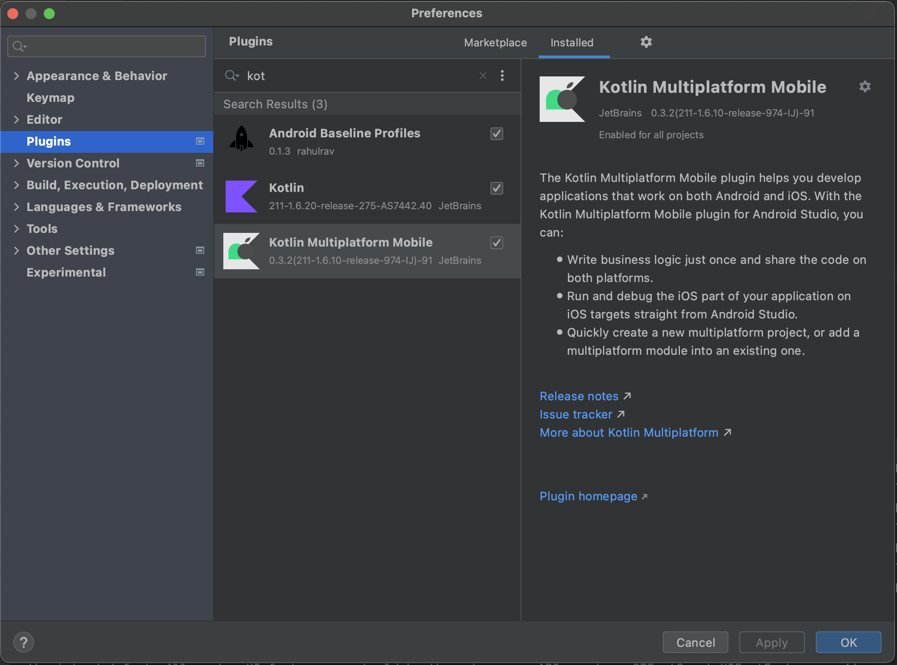
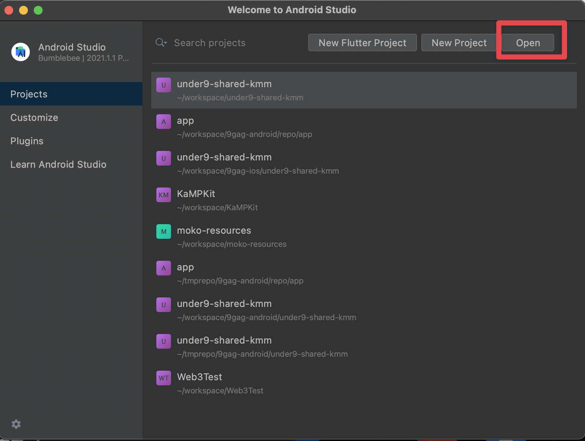
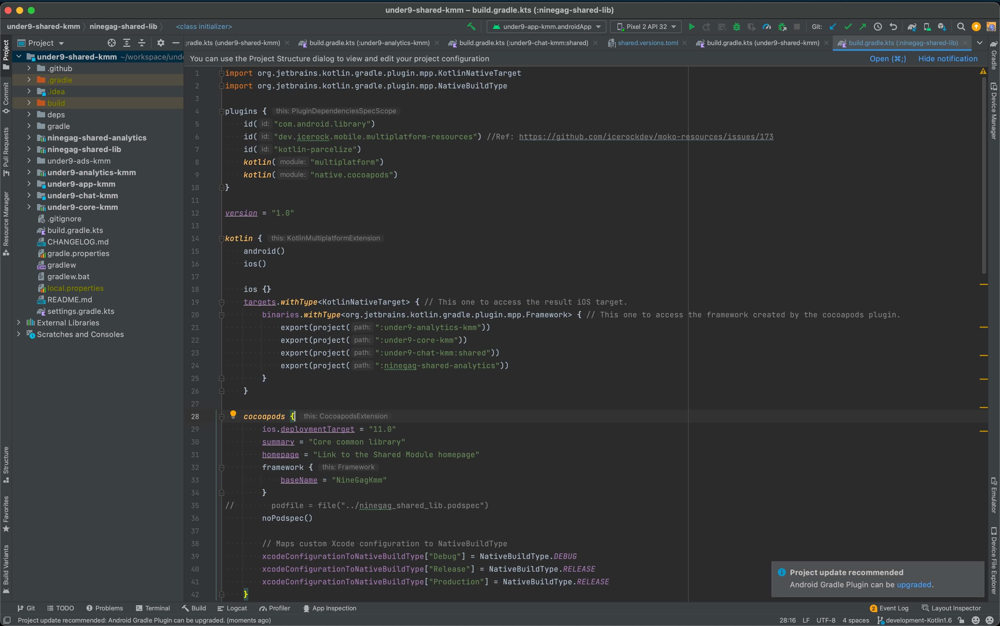
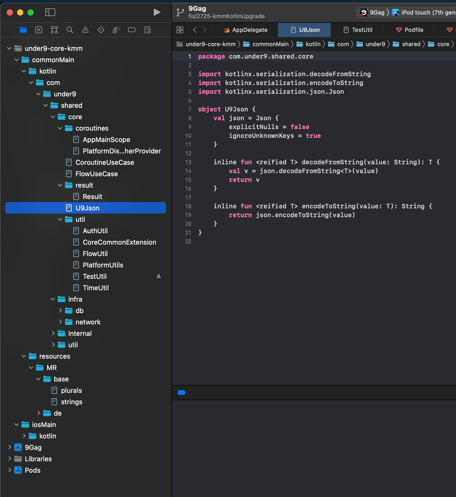
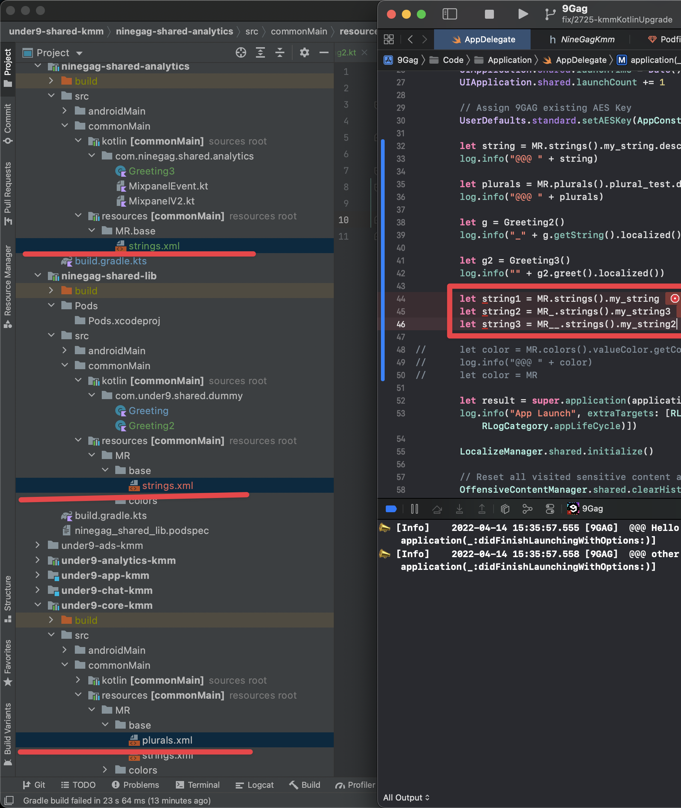
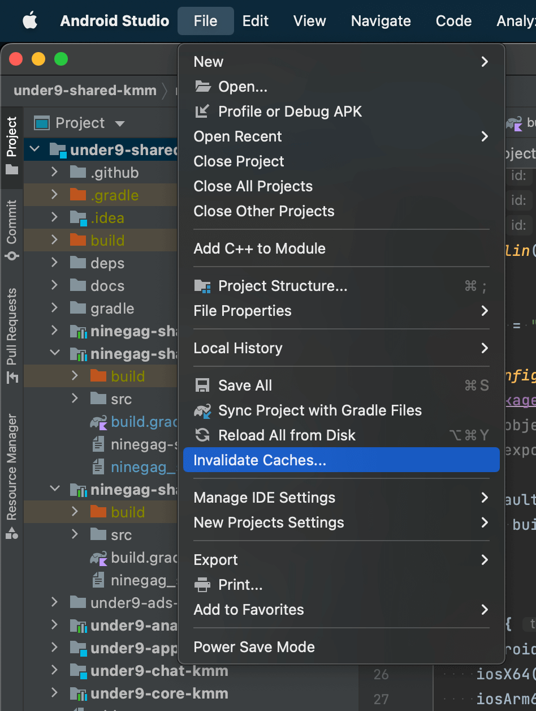
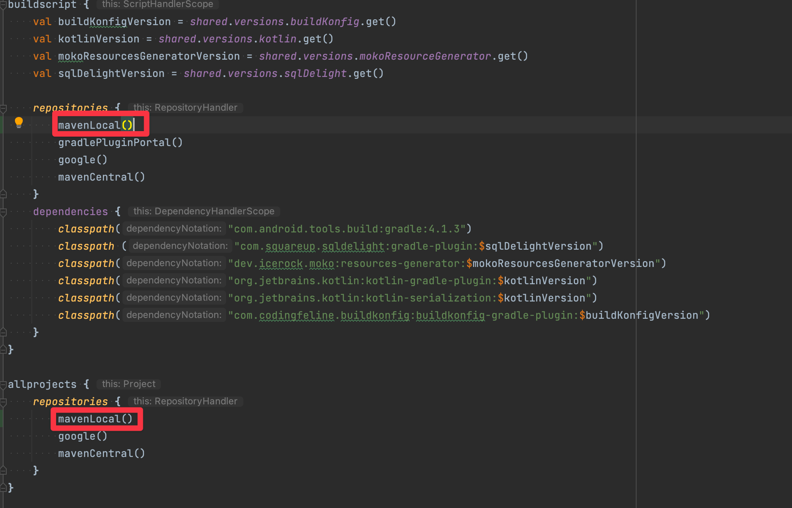
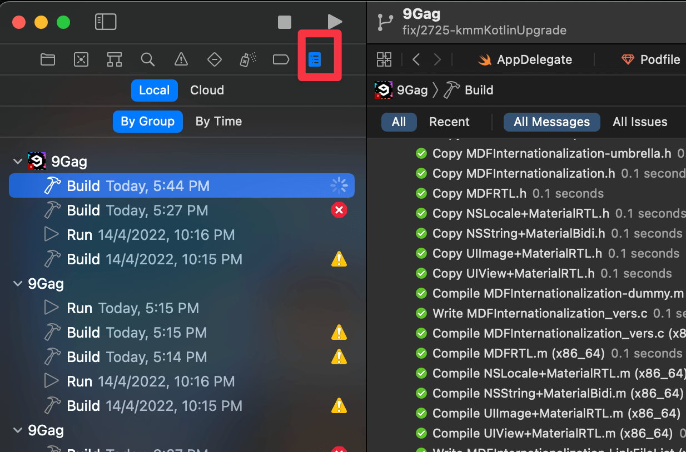

[](https://dl.circleci.com/status-badge/redirect/gh/9gag/under9-shared-kmm/tree/development)

# Read me

This is the root directory for Kotlin multiplatform mobile (KMM).

# Setup

## JDK

Requirement: JDK 11

### Installation

- Install [Amazon Corretto](https://docs.aws.amazon.com/corretto/latest/corretto-8-ug/macos-install.html) (Recommended by touchlab) OR
- [SDKMan](https://sdkman.io/) - JDK version manager and installer. OR
- [AdoptOpenJDK](https://adoptopenjdk.net/) - Alternate JDK distribution OR
- [asdf](https://asdf-vm.com/guide/getting-started.html#_1-install-dependencies) - Manage multiple runtime versions with a single CLI tool
  - [Install asdf plugin for JDK installation](https://github.com/halcyon/asdf-java)

## IDE

### Kotlin development

- Android Studio (Recommended) / Intellij Community Edition
- Install KMM plugin (Android Studio ➝ Preferences ➝ search for "Kotlin Multiplatform Mobile")

- Clone and import this project to IDE

- Correctly imported project should be like this


### iOS development + Kotlin

- Follow the guide to install [xcode plugin](https://github.com/touchlab/xcode-kotlin)
- Supported: Basic synatax highlight, set breakpoint and step through code
- Limitation: No autocomplete, no auto-indentation


### Resource sharing

- Using [moko-resources](https://github.com/icerockdev/moko-resources)
- Recommended resources sharing: strings only
  - Colors, images/assets not recommended at the moment due to [some issues](https://app.clickup.com/t/24b8t2z) are found.
- Limitation on iOS
  - Multi-module strings. Considering there are 3 strings.xml , if we want to directly access the string, it will be accessed by `MR` , `MR_` and `MR__` , which will be unreadable. This is due to KMM's limitation at the moment. Similar thing will happen if we have the same class/interface name but with different namespace.
  - 
- Possible solutions/Workaround
  - Using `typealias`
  - Using wrapper function and try not call strings directly

## Adding modules to existing project

### Android

- As usual, specifying modules to be included, the path in project's `settings.gradle`

### iOS

- Follow (this guide)[https://kotlinlang.org/docs/mobile/integrate-in-existing-app.html]

## Development

### Troubleshooting KMM project

#### Gradle issue

If you see the following or similar error after adding new libraries or gradle plugin or whatever when you try to sync Gradle:

```text
Could not resolve project :under9-core-kmm.
Required by:
    project :ninegag-shared-app
```

1. Make sure `settings.gradle` in `under9-shared-kmm` is correct
2. Try "Invalidate cache" option in IDE

   
#### Gradle plugin debug tips

If you are working on some 3rd party gradle plugins and would like to see what's going on. You may follow these steps. Taking `icerockdev/moko-resources` as example
1. Clone the repo
2. `cd` to `icerockdev/moko-resources`, modify their library version to e.g. `0.19.1-SANPSHOT`
3. After adding debug log in their source code, execute `./gradlew publishToMavenLocal`. The JAR will be published to `~/.m2/repository/dev/icerock/moko/*`
4. Go back to `under9-shared-kmm`, update `build.gradle.kts` add `mavenLocal()` as one of the source. As screenshot

5. Update `shared.versions.toml`, `mokoResourceGenerator` version to `0.19.1-SNAPSHOT`

#### \[iOS\] KMM project integration debug

- Check build log in xcode

- Run `./gradlew assembleNinegagKmmFramework` to make sure code is compilable before integrating to iOS

#### \[iOS\] bundle with identifier `xxxx` not found error

You may see this error from log.

```text
Uncaught Kotlin exception: kotlin.IllegalArgumentException: bundle with identifier com.under9.shared.res.MR not found
    at 0   9Gag                                0x103be8c38        kfun:kotlin.Throwable#<init>(kotlin.String?){} + 88 
    at 1   9Gag                                0x103be28a6        kfun:kotlin.Exception#<init>(kotlin.String?){} + 86 
    at 2   9Gag                                0x103be2a96        kfun:kotlin.RuntimeException#<init>(kotlin.String?){} + 86 
    at 3   9Gag                                0x103be2e66        kfun:kotlin.IllegalArgumentException#<init>(kotlin.String?){} + 86 
    at 4   9Gag                                0x104111c66        kfun:dev.icerock.moko.resources.utils#loadableBundle__at__platform.Foundation.NSBundle.Companion(kotlin.String){}platform.Foundation.NSBundle + 4086 
    at 5   9Gag                                0x1039376d1        kfun:com.under9.shared.res.MR.<init>$lambda-0#internal + 145 
    at 6   9Gag                                0x103937786        kfun:com.under9.shared.res.MR.$<init>$lambda-0$FUNCTION_REFERENCE$53.invoke#internal + 118 
    at 7   9Gag                                0x103bfa72e        kfun:kotlin.native.concurrent.FreezeAwareLazyImpl.getOrInit#internal + 942 
    at 8   9Gag                                0x103bfadc5        kfun:kotlin.native.concurrent.FreezeAwareLazyImpl#<get-value>(){}1:0 + 421 
    at 9   9Gag                                0x103935c3f        kfun:com.under9.shared.res.MR.<get-bundle>#internal + 223 
    at 10  9Gag                                0x103935ea6        kfun:com.under9.shared.res.MR.strings#<init>(){} + 454 
    at 11  9Gag                                0x103d3cb44        InitSingletonStrict + 964 
```

1. Check `ss.resources           = 'ninegag-shared-lib/build/XCFrameworks/release/NineGagKmm.xcframework'` is defined in `under9-shared-kmm-export-ios.podspec`
2. Check in `ninegag-shared-lib/build/XCFrameworks/release/NineGagKmm.xcframework/*/NineGagKmm.framework/*.bundle` is there

### Logging

- Use [Napier](https://github.com/AAkira/Napier) to do logging in KMM module.

### HTTP Client

- Use [Ktor](https://kotlinlang.org/docs/mobile/use-ktor-for-networking.html)

### Threading and concurrency

### Do's and Don'ts

**Do's**

- Writing as much as code inside `commonMain`.
- At least make sure it compiles on both platforms when pushing new commenits or creating PRs.
- Use immutable variable as much as possible, in case mutable is needed, please refer to [this](https://kotlinlang.org/docs/mobile/concurrency-overview.html). Library [Stately](https://github.com/touchlab/Stately) is included, make use of this library.
- For Kotlin `object`, please mark it as `ThreadLocal`, as we are using native coroutine, otherwise `InvalidMutabilityException` may be thrown when called.

**Don'ts**

- Overused `expect` and `actual` class. ([Reference](https://kotlinlang.org/docs/mpp-connect-to-apis.html))
- Import anything related to `java`, `android` inside classes under `commonMain`, as this is going to be shared across platforms.
